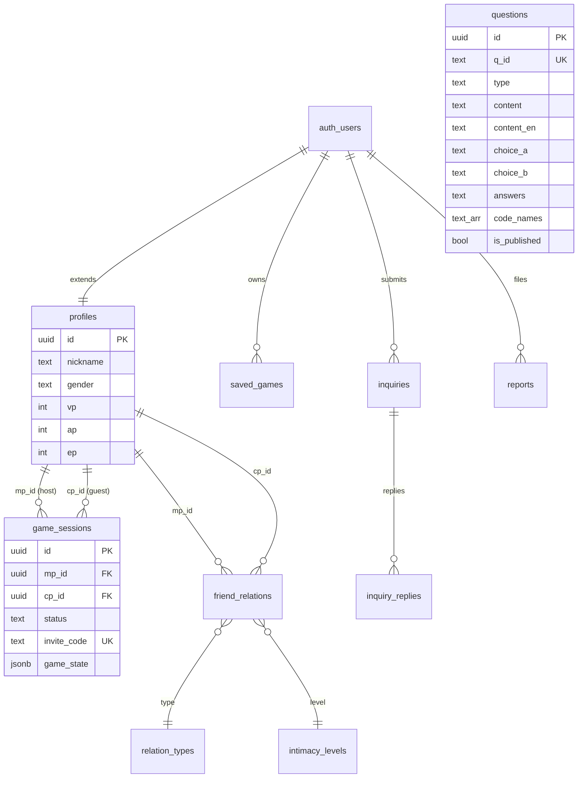

# TalkBingo Supabase Schema Design

> **Last Updated**: 2026-02-10
> **Project ID**: `jmihbovtywtwqdjrmuey`
> **Region**: `us-east-1`
> **DB Version**: PostgreSQL 17.6

이 문서는 TalkBingo Supabase 프로젝트의 **실제 운영 DB 스키마**를 기준으로 작성되었습니다.
다른 프로젝트에서 이 DB를 **데이터 소스**로 활용할 때 참조하세요.

---

## 목차

1. [테이블 개요 (Table Overview)](#1-테이블-개요)
2. [Core 테이블 (사용자/관계)](#2-core-테이블)
3. [Game 테이블 (게임 세션)](#3-game-테이블)
4. [Content 테이블 (퀴즈 데이터)](#4-content-테이블)
5. [Support 테이블 (문의/신고/공지)](#5-support-테이블)
6. [Lookup 테이블 (참조 데이터)](#6-lookup-테이블)
7. [RLS 정책 요약](#7-rls-정책-요약)
8. [외부 프로젝트 접근 가이드](#8-외부-프로젝트-접근-가이드)
9. [ER 다이어그램](#9-er-다이어그램)

---

## 1. 테이블 개요

| # | Table | Domain | Rows | RLS | 설명 |
|---|-------|--------|------|-----|------|
| 1 | `profiles` | Core | 119 | ✅ | 사용자 프로필 (auth.users 확장) |
| 2 | `friend_relations` | Core | 0 | ✅ | 사용자 간 관계 |
| 3 | `game_sessions` | Game | 157 | ✅ | 게임 세션 |
| 4 | `saved_games` | Game | 1 | ✅ | 저장된 게임 데이터 |
| 5 | `questions` | Content | 1,507 | ✅ | 퀴즈 질문 (Balance/Truth) |
| 6 | `notices` | Support | 1 | ✅ | 공지사항 |
| 7 | `inquiries` | Support | 0 | ✅ | 사용자 문의 |
| 8 | `inquiry_replies` | Support | 0 | ✅ | 문의 답변 |
| 9 | `reports` | Support | 12 | ✅ | 질문 신고 |
| 10 | `relation_types` | Lookup | 3 | ❌ | 관계 유형 코드 (B, Fa, Lo) |
| 11 | `intimacy_levels` | Lookup | 5 | ❌ | 친밀도 레벨 (L1~L5) |

---

## 2. Core 테이블

### 2.1 `profiles`

`auth.users`를 확장하는 사용자 프로필 테이블.

| Column | Type | Nullable | Default | 설명 |
|--------|------|----------|---------|------|
| `id` | UUID (PK) | NO | — | `auth.users.id` FK |
| `nickname` | TEXT | YES | — | 닉네임 |
| `age` | INT | YES | — | 나이 |
| `gender` | TEXT | YES | — | 성별 (`M`, `F`, `O`) |
| `hometown` | TEXT | YES | — | 고향 |
| `location` | TEXT | YES | — | 현재 위치 |
| `role` | TEXT | YES | `'user'` | 역할 (`admin`, `user`, `guest`) |
| `consent` | BOOLEAN | YES | `false` | 약관 동의 여부 |
| `vp` | INT | YES | `0` | Victory Points |
| `ap` | INT | YES | `0` | Activity Points |
| `ep` | INT | YES | `0` | Experience Points |
| `created_at` | TIMESTAMPTZ | YES | `now()` | 생성일 |
| `updated_at` | TIMESTAMPTZ | YES | `now()` | 수정일 |

**FK**: `profiles.id` → `auth.users.id` (ON DELETE CASCADE)

---

### 2.2 `friend_relations`

사용자 간 관계(친구/가족/연인) 매핑 테이블.

| Column | Type | Nullable | Default | 설명 |
|--------|------|----------|---------|------|
| `id` | UUID (PK) | NO | `uuid_generate_v4()` | — |
| `mp_id` | UUID | YES | — | 호스트 (FK → `profiles.id`) |
| `cp_id` | UUID | YES | — | 게스트 (FK → `profiles.id`) |
| `relation_type_id` | INT | YES | — | FK → `relation_types.id` |
| `intimacy_level_id` | INT | YES | — | FK → `intimacy_levels.id` |
| `sub_relation_code` | TEXT | YES | — | 세부 관계 코드 (`Ar`, `Sc` 등) |
| `created_at` | TIMESTAMPTZ | YES | `now()` | 생성일 |

**Unique**: `(mp_id, cp_id)`

---

## 3. Game 테이블

### 3.1 `game_sessions`

실시간 멀티플레이어 게임 세션.

| Column | Type | Nullable | Default | 설명 |
|--------|------|----------|---------|------|
| `id` | UUID (PK) | NO | `uuid_generate_v4()` | — |
| `mp_id` | UUID | YES | — | 호스트 (FK → `profiles.id`) |
| `cp_id` | UUID | YES | — | 게스트 (FK → `profiles.id`) |
| `status` | TEXT | YES | `'waiting'` | `waiting`, `playing`, `paused`, `finished` |
| `invite_code` | TEXT | YES (Unique) | — | 초대 코드 |
| `game_state` | JSONB | YES | — | 게임 상태 전체 스냅샷 |
| `created_at` | TIMESTAMPTZ | YES | `now()` | 생성일 |
| `updated_at` | TIMESTAMPTZ | YES | `now()` | 수정일 |

---

### 3.2 `saved_games`

사용자별 게임 저장 데이터.

| Column | Type | Nullable | Default | 설명 |
|--------|------|----------|---------|------|
| `id` | UUID (PK) | NO | `gen_random_uuid()` | — |
| `user_id` | UUID | NO | — | FK → `auth.users.id` |
| `game_data` | JSONB | NO | — | 전체 게임 데이터 |
| `created_at` | TIMESTAMPTZ | NO | `timezone('utc', now())` | 생성일 |
| `updated_at` | TIMESTAMPTZ | NO | `timezone('utc', now())` | 수정일 |

---

## 4. Content 테이블

### 4.1 `questions` ⭐

**다른 프로젝트에서 가장 많이 참조할 핵심 테이블**. Balance/Truth 퀴즈 질문 데이터.

| Column | Type | Nullable | Default | 설명 |
|--------|------|----------|---------|------|
| `id` | UUID (PK) | NO | `gen_random_uuid()` | — |
| `q_id` | TEXT (Unique) | NO | — | 관리 ID (예: `B26-00001`, `T26-00001`) |
| `type` | TEXT | NO | — | `Balance` 또는 `Truth` |
| `content` | TEXT | NO | — | 질문 텍스트 (한국어) |
| `content_en` | TEXT | YES | — | 질문 텍스트 (영어) |
| `choice_a` | TEXT | YES | — | Balance 선택지 A (한국어) |
| `choice_b` | TEXT | YES | — | Balance 선택지 B (한국어) |
| `choice_a_en` | TEXT | YES | — | Balance 선택지 A (영어) |
| `choice_b_en` | TEXT | YES | — | Balance 선택지 B (영어) |
| `answers` | TEXT | YES | — | Truth 답변 가이드 (한국어) |
| `answers_en` | TEXT | YES | — | Truth 답변 가이드 (영어) |
| `details` | JSONB | YES | `'{}'` | 추가 상세 데이터 (한국어) |
| `details_en` | JSONB | YES | — | 추가 상세 데이터 (영어) |
| `code_names` | TEXT[] | YES | `'{}'` | 타겟팅 태그 배열 (예: `*-*-B-Ar-L3`) |
| `is_published` | BOOLEAN | YES | `false` | 공개 여부 |
| `created_at` | TIMESTAMPTZ | YES | `now()` | 생성일 |
| `updated_at` | TIMESTAMPTZ | YES | `now()` | 수정일 |

#### `q_id` 포맷

```
[Type Prefix][Year]-[Sequential Number]
예: B26-00001 (Balance, 2026년, #1)
    T26-00001 (Truth, 2026년, #1)
```

#### `code_names` 구조

```
[MP_Gender]-[CP_Gender]-[Relation]-[SubRelation]-[Intimacy]
예: *-*-B-Ar-L3  (모든 성별, 친구-어릴적친구, L3)
    *-*-B-*-L1   (모든 성별, 친구-전체, L1)
```

#### 타입별 컬럼 사용법

| 컬럼 | Balance | Truth |
|------|---------|-------|
| `content` | 질문 텍스트 | 질문 텍스트 |
| `choice_a` / `choice_b` | ✅ 선택지 A/B | ❌ NULL |
| `answers` | ❌ NULL | ✅ 답변 가이드 |
| `details` | 기타 메타 | 기타 메타 |

#### 외부 프로젝트 접근 예시

```sql
-- 📌 공개된 Balance 질문만 가져오기
SELECT q_id, content, content_en, choice_a, choice_b, choice_a_en, choice_b_en, code_names
FROM questions
WHERE type = 'Balance' AND is_published = true;

-- 📌 공개된 Truth 질문만 가져오기
SELECT q_id, content, content_en, answers, answers_en, code_names
FROM questions
WHERE type = 'Truth' AND is_published = true;

-- 📌 특정 관계/친밀도 타겟팅 질문 검색
SELECT * FROM questions
WHERE '*-*-B-Ar-L3' = ANY(code_names)
  AND is_published = true;

-- 📌 전체 질문 수 조회
SELECT type, COUNT(*) FROM questions GROUP BY type;
```

---

## 5. Support 테이블

### 5.1 `notices`

앱 내 공지사항.

| Column | Type | Nullable | Default | 설명 |
|--------|------|----------|---------|------|
| `id` | UUID (PK) | NO | `gen_random_uuid()` | — |
| `title` | TEXT | NO | — | 제목 |
| `content` | TEXT | NO | — | 내용 |
| `is_active` | BOOLEAN | YES | `true` | 활성 여부 |
| `created_at` | TIMESTAMPTZ | NO | `timezone('utc', now())` | 생성일 |

---

### 5.2 `inquiries`

사용자 1:1 문의.

| Column | Type | Nullable | Default | 설명 |
|--------|------|----------|---------|------|
| `id` | UUID (PK) | NO | `gen_random_uuid()` | — |
| `user_id` | UUID | YES | — | FK → `auth.users.id` |
| `category` | TEXT | NO | — | 문의 카테고리 |
| `title` | TEXT | NO | — | 제목 |
| `content` | TEXT | NO | — | 내용 |
| `is_private` | BOOLEAN | YES | `true` | 비공개 여부 |
| `status` | TEXT | YES | `'submitted'` | 처리 상태 |
| `app_version` | TEXT | YES | — | 앱 버전 |
| `device_info` | JSONB | YES | — | 디바이스 정보 |
| `created_at` | TIMESTAMPTZ | YES | `now()` | 생성일 |
| `updated_at` | TIMESTAMPTZ | YES | `now()` | 수정일 |

---

### 5.3 `inquiry_replies`

문의 답변.

| Column | Type | Nullable | Default | 설명 |
|--------|------|----------|---------|------|
| `id` | UUID (PK) | NO | `gen_random_uuid()` | — |
| `inquiry_id` | UUID | NO | — | FK → `inquiries.id` |
| `admin_id` | UUID | YES | — | FK → `auth.users.id` |
| `content` | TEXT | NO | — | 답변 내용 |
| `created_at` | TIMESTAMPTZ | YES | `now()` | 생성일 |

---

### 5.4 `reports`

질문 신고.

| Column | Type | Nullable | Default | 설명 |
|--------|------|----------|---------|------|
| `id` | UUID (PK) | NO | `gen_random_uuid()` | — |
| `q_id` | TEXT | NO | — | 신고된 질문 ID |
| `reporter_id` | UUID | YES | — | FK → `auth.users.id` |
| `reason` | TEXT | NO | — | 신고 사유 |
| `details` | TEXT | YES | — | 상세 내용 |
| `created_at` | TIMESTAMPTZ | YES | `now()` | 생성일 |

---

## 6. Lookup 테이블

### 6.1 `relation_types`

관계 유형 코드 (RLS 없음, 공개 데이터).

| Column | Type | 설명 |
|--------|------|------|
| `id` | SERIAL (PK) | — |
| `code` | TEXT (Unique) | `B` (친구), `Fa` (가족), `Lo` (연인) |
| `label` | TEXT | 표시 이름 |

### 6.2 `intimacy_levels`

친밀도 레벨 (RLS 없음, 공개 데이터).

| Column | Type | 설명 |
|--------|------|------|
| `id` | SERIAL (PK) | — |
| `code` | TEXT (Unique) | `L1` ~ `L5` |
| `label` | TEXT | 표시 이름 |

---

## 7. RLS 정책 요약

모든 테이블에 RLS가 활성화되어 있습니다 (`relation_types`, `intimacy_levels` 제외).

| Table | SELECT | INSERT | UPDATE | DELETE |
|-------|--------|--------|--------|--------|
| `profiles` | 전체 공개 | 본인만 (`auth.uid() = id`) | 본인만 | — |
| `questions` | 전체 공개 | 전체 허용 | 전체 허용 | — |
| `game_sessions` | 전체 공개 | 인증 사용자 | 참여자 | — |
| `friend_relations` | 전체 공개 | 호스트만 (`auth.uid() = mp_id`) | — | — |
| `saved_games` | 본인만 | 본인만 | 본인만 | — |
| `notices` | 전체 공개 | — | — | — |
| `inquiries` | 본인 / 공개 문의 | 본인만 | — | — |
| `inquiry_replies` | 관련 문의 소유자 | — | — | — |
| `reports` | — | 전체 허용 | — | — |

> [!IMPORTANT]
> 외부 프로젝트에서 데이터를 읽을 때는 **`anon` key + RLS** 정책을 확인하세요.
> `questions` 테이블은 `SELECT`가 전체 공개이므로 `anon` key로 바로 접근 가능합니다.

---

## 8. 외부 프로젝트 접근 가이드

### 8.1 접속 정보

```
Supabase URL : https://jmihbovtywtwqdjrmuey.supabase.co
API Key      : (Dashboard → Settings → API → Project API keys)
```

### 8.2 Supabase Client 초기화 (예: JavaScript)

```javascript
import { createClient } from '@supabase/supabase-js';

const supabase = createClient(
  'https://jmihbovtywtwqdjrmuey.supabase.co',
  'YOUR_ANON_KEY'
);
```

### 8.3 데이터 접근 패턴

**읽기 전용** 사용 시, 아래 테이블이 `anon` key로 SELECT 가능합니다:

| Table | anon SELECT | 비고 |
|-------|-------------|------|
| `questions` | ✅ | 핵심 콘텐츠 테이블 |
| `profiles` | ✅ | 사용자 프로필 (공개) |
| `notices` | ✅ | 공지사항 |
| `relation_types` | ✅ | RLS 없음 |
| `intimacy_levels` | ✅ | RLS 없음 |
| `game_sessions` | ✅ | 게임 세션 (공개) |

**Supabase JS 예시:**

```javascript
// Balance 질문 전체 조회
const { data, error } = await supabase
  .from('questions')
  .select('q_id, content, content_en, choice_a, choice_b, choice_a_en, choice_b_en, code_names')
  .eq('type', 'Balance')
  .eq('is_published', true);

// 특정 관계 타겟팅 질문 검색
const { data, error } = await supabase
  .from('questions')
  .select('*')
  .contains('code_names', ['*-*-B-Ar-L3'])
  .eq('is_published', true);

// Lookup 테이블 조회
const { data: relations } = await supabase.from('relation_types').select('*');
const { data: levels } = await supabase.from('intimacy_levels').select('*');
```

---

## 9. ER 다이어그램


