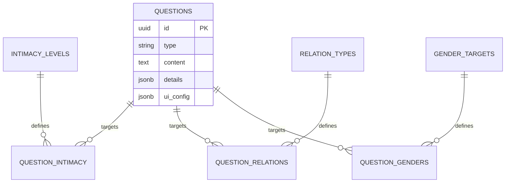

# TalkBingo Supabase Table Definition

이 문서는 TalkBingo의 핵심 데이터인 **T(Truth)**, **B(Balance)**, **M(Mini Game)** 타입을 Supabase(PostgreSQL) 테이블로 명확하게 구분하고, **Flutter Web App** 환경에서 효율적으로 사용하기 위한 스키마를 정의합니다.

---

## 1. Questions Table (핵심 질문/게임 테이블)

모든 게임 콘텐츠는 `questions` 테이블에 저장되며, `type` 컬럼으로 구분됩니다.

### 1.1 테이블 스키마 (Table Schema)

| 컬럼명 (Column) | 타입 | 설명 | 예시 |
| --- | --- | --- | --- |
| `id` | UUID (PK) | 고유 ID (generated) | `uuid_v4()` |
| `legacy_q_id` | String | (Optional) 기존 CSV의 q_id | `"T25-00001"` |
| `type` | String | 콘텐츠 타입 (`T`, `B`, `M`) | `"B"` |
| `content` | Text | 질문 내용 또는 게임 설명 | `"짜장면 vs 짬뽕"` |
| `details` | JSONB | 타입별 상세 데이터 (하단 참조) | `{"choice_a": "...", "choice_b": "..."}` |
| `ui_config` | JSONB | Flutter UI용 설정 (테마, 아이콘 등) | `{"theme": "#FF0000"}` |
| `code_names` | String[] | (Legacy/Simple) 타겟 코드네임 배열 | `["M-F-B-Ar-L2"]` |
| `created_at` | Timestamptz | 생성일 | `now()` |

---

### 1.2 `details` JSONB 구조 (Type-Specific Properties)

#### 🅰️ T Type: Truth Game (진실 게임)
서로에 대해 깊이 알아가는 대화형 질문입니다.

```json
{
  "answers": "솔직하게 말해주세요.",
  "keywords": ["음식", "취향"]
}
```

#### 🅱️ B Type: Balance Game (밸런스 게임)
두 가지 선택지 중 하나를 고르는 게임입니다.

```json
{
  "choice_a": "짜장면",
  "choice_b": "짬뽕",
  "stats_a": 45, // Optional
  "stats_b": 55  // Optional
}
```

#### Ⓜ️ M Type: Mini Game (미니 게임 - 패자부활전)
Lock된 빙고 칸을 해제하기 위한 간단한 HTML5/Flutter 위젯 게임입니다.

```json
{
  "game_code": "rock_paper_scissors",
  "difficulty": 3,
  "config": {
    "time": 30,
    "target": 5
  },
  "asset_url": "/assets/games/rps.png"
}
```

---

## 2. Flutter Web App을 위한 추가 속성 (`ui_config`)

Flutter 프론트엔드에서 **UI 렌더링**, **애니메이션**을 효율적으로 수행하기 위해 `ui_config` JSONB 컬럼을 활용합니다.

```json
{
  "ui_theme": "0xFFBD0558", 
  "icon_asset": "assets/icons/food.png",
  "lottie_url": "https://...",
  "layout_type": "center_big"
}
```

---

## 3. 타겟팅 및 관계 테이블 (Targeting Tables)

질문이 누구에게 노출될지 결정하는 관계형 테이블들입니다 (N:M 매핑).

### 3.1 Intimacy Levels Table
- **Table Name**: `intimacy_levels`
- **Columns**: `id` (PK), `code` (e.g., 'L1'), `badge_asset`

### 3.2 Relation Types Table
- **Table Name**: `relation_types`
- **Columns**: `id` (PK), `code` ('Friend'), `display_name` ('친구')

### 3.3 Gender Targets Table
- **Table Name**: `gender_targets`
- **Columns**: `id` (PK), `host_gender`, `guest_gender`

---

## 4. Entity Relationship Diagram (ERD Summary)



